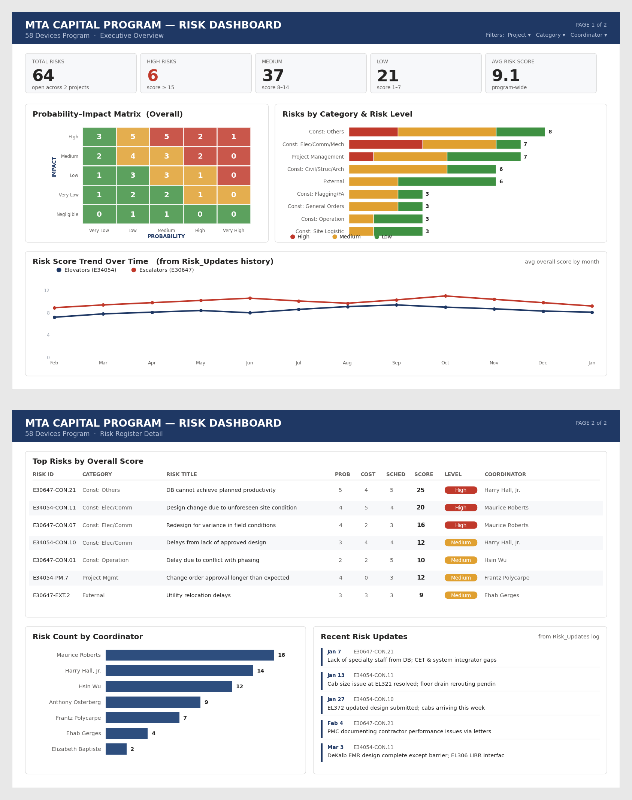

# Tonnelle Risk Dashboard

Power BI dashboard for the Tonnelle Avenue Bridge Relocation contract (project `TONN-01`). Three pages: Executive Overview, Risk Register Detail, Risk Detail (drillthrough). Internal Naik leadership audience.

Data flow: two Excel workbooks in `/source_data/` feed a Power BI Project (`.pbip`) under `/pbip/`. Humans only edit Excel; the dashboard re-reads Excel on Refresh.

> **Visual state (2026-05-23):** the build is structurally complete. 15 measures, 23 visuals, drillthrough wired end-to-end. The styling layer is rough; a future visual-polish phase will close the gap to the mockup in [assets/risk_dashboard_mockup.png](assets/risk_dashboard_mockup.png).

## What this is

A risk-register reporting tool. The risk manager (RM) edits an Excel file; this dashboard reads that file and renders summary KPIs, a probability-impact heatmap, a filterable risk table, an update activity trend, and a per-risk drillthrough page. Nobody edits the dashboard or the data inside Power BI. All edits happen in Excel.

This README is written for future-you returning after a few months away. You will need to remember how to (a) refresh the dashboard after a data change, (b) add a new update, and (c) recognize the few known traps. Each section below answers one of those.

## Design reference



The mockup above is the styling target. It was adapted from a prior MTA Capital Program template for the Tonnelle layout. Headers, palette tokens, KPI density, and the three-page structure are all from this mockup. The currently-shipped report has the right data, measures, and layout positions but not the typography/spacing polish.

## File map

| Path | What's there |
|---|---|
| [source_data/](source_data/) | Two read-only Excel files. The data layer. Edit here, not in Power BI. |
| [pbip/](pbip/) | Power BI Project. Open [pbip/Tonnelle_Risk.pbip](pbip/Tonnelle_Risk.pbip) in Power BI Desktop. |
| [pbip/Tonnelle_Risk.SemanticModel/](pbip/Tonnelle_Risk.SemanticModel/) | Data model (TMDL): 8 tables, 3 relationships, 15 measures. |
| [pbip/Tonnelle_Risk.Report/](pbip/Tonnelle_Risk.Report/) | Report (PBIR JSON): 3 pages, 23 visuals, theme reference. |
| [assets/](assets/) | Mockup PNG, theme JSON, design spec, prompt log, blank Excel template, pill reference SVGs. |
| [assets/RISK_DASHBOARD_turnover.md](assets/RISK_DASHBOARD_turnover.md) | Original brief. The "why". |
| [assets/theme.json](assets/theme.json) | Custom Power BI theme. Applied once in Desktop. |
| [docs/](docs/) | 13 phase deliverables. Locked once placed. |
| [scripts/](scripts/) | Python utilities. Operational tooling; not part of the dashboard runtime. |
| [archive/](archive/) | Pre-edit snapshots of prior MASTER files. Rollback vault. Do not modify. |
| [CLAUDE.md](CLAUDE.md) | Project memory for AI assistance. Single source of locked decisions. |
| README.md | This file. |
| [docs/13_portfolio_writeup.md](docs/13_portfolio_writeup.md) | Portfolio framing for an external reviewer. |

### PBIP folder layout (the part you will keep forgetting)

```
pbip/
  Tonnelle_Risk.pbip                       envelope file; opens in Power BI Desktop
  Tonnelle_Risk.SemanticModel/
    definition/
      database.tmdl, model.tmdl, relationships.tmdl, expressions.tmdl
      cultures/en-US.tmdl
      tables/
        Risk_Register.tmdl                 37 rows; fact-like table; carries the Power Query M
        Risk_Updates.tmdl                  127 rows; event log; carries M
        Project.tmdl                       1 row; project metadata; carries M
        Lookups.tmdl                       16 rows; hardcoded reference list; carries M
        dim_Date.tmdl                      ~730 rows; DAX-calculated calendar table
        dim_Probability.tmdl               5 rows; DAX-calculated 1..5 axis dim
        dim_Impact.tmdl                    5 rows; DAX-calculated 1..5 axis dim
        _Measures.tmdl                     15 measures across 4 display folders
  Tonnelle_Risk.Report/
    definition/
      report.json, version.json
      pages/
        pages.json                         page list and active page
        Overview/page.json + visuals/      9 visuals: PageHeader, 5 KPI cards, PIMatrix, RisksByCategory, RiskActivity
        Detail/page.json + visuals/        7 visuals: PageHeader, 3 slicers, TopRisks, RisksByCoordinator, RecentRiskUpdates
        RiskDetail/page.json + visuals/    7 visuals: BackButton, RiskTitle, MetaStrip, Mitigation label+paragraph, Updates History label+table; hidden, drillthrough destination
    StaticResources/                       theme references; auto-managed by Power BI Desktop
```

The `.pbip` file is a one-line JSON envelope pointing at the two sibling folders. TMDL and PBIR JSON are both plain-text. The whole project is source-controllable.

## Refresh workflow

The Excel files in [source_data/](source_data/) are the data layer. Edit Excel; refresh Power BI.

1. Open the relevant workbook in Excel:
   - [Tonnelle_Risk_Register_MASTER.xlsx](source_data/Tonnelle_Risk_Register_MASTER.xlsx) for risk attributes, scores, mitigation log.
   - [Tonnelle_Risk_Updates_MASTER.xlsx](source_data/Tonnelle_Risk_Updates_MASTER.xlsx) for the dated update history.
2. Make edits. Save. Close.
3. Open [pbip/Tonnelle_Risk.pbip](pbip/Tonnelle_Risk.pbip) in **Power BI Desktop**.
4. **Home** ribbon, then **Refresh**.
5. The five tables reload, the 15 measures re-evaluate, all 23 visuals update.

If Power BI prompts for a Power Query parameter named `Source_Folder`, set it to the absolute path of the [source_data/](source_data/) folder with a trailing backslash (Windows). On this machine that is `C:\Users\jkhbu\OneDrive\Projects\powerbi\risk_register\source_data\`. The parameter persists in the model once set.

### Common refresh failures

- **"File not found"**: the Excel filename has drifted from the `*_MASTER.xlsx` convention. Either rename back or update the Power Query M code in the corresponding table TMDL file.
- **"Column not found"**: a header in Excel was renamed or deleted. Power Query expects headers verbatim (`risk_id`, `mitigation_log`, etc.). Either restore the header or update the M.
- **Row count short by 3**: Risk_Register has an M step `Table.RemoveLastN(WithSort, 3)` that drops 3 trailing all-null rows from the source workbook. If you add real risks past row 40, that step may discard real data. Edit the M to remove the step or reduce the count.

## Adding a new update

`Risk_Updates` is the event log. New entries appear on Page 1 (Risk Activity), Page 2 (Recent Risk Updates), and Page 3 (Updates History, after drillthrough) once you refresh.

Two paths. Pick the one that matches what you already changed.

### Path A: Edit Risk_Updates directly in Excel

Use when you want to add one or two ad-hoc events without touching `mitigation_log` on the Register.

1. Open [Tonnelle_Risk_Updates_MASTER.xlsx](source_data/Tonnelle_Risk_Updates_MASTER.xlsx).
2. Append a row at the bottom with these columns in this exact order:
   - `update_id`: next sequential integer (look at the last row, add 1).
   - `risk_id`: must exactly match a `risk_id` value in Risk_Register (format `TONN-CON.NN`).
   - `update_date`: a real date (Excel date cell type).
   - `update_year`: the year as an integer.
   - `author`: a name string.
   - `note`: free-text description of the update.
3. Save. Close.
4. Refresh the PBIP per the workflow above.

### Path B: Run `scripts/append_updates.py` after editing `mitigation_log`

Use when the risk manager has added dated entries to `mitigation_log` cells in the Register and you want `Risk_Updates` to catch up automatically.

1. Make the `mitigation_log` edits in [Tonnelle_Risk_Register_MASTER.xlsx](source_data/Tonnelle_Risk_Register_MASTER.xlsx). The format is `M/D - text of the entry. M/D - next entry. ...` (e.g., `5/22 - inspection complete`). Save the file.
2. From the project root in a terminal, run a dry-run first to see what the script will append:
   ```
   PYTHONUTF8=1 PYTHONIOENCODING=utf-8 python scripts/append_updates.py --dry-run
   ```
3. Review the proposed rows. Any row marked `[FLAG]` is dated more than 45 days from today; verify the year is right before committing.
4. If the proposed list looks correct, drop `--dry-run` and re-run:
   ```
   PYTHONUTF8=1 PYTHONIOENCODING=utf-8 python scripts/append_updates.py
   ```
5. The script auto-archives the current Updates file to [archive/](archive/) before writing. Archive filename: `Tonnelle_Risk_Updates_<YYMMDD>.xlsx` where `YYMMDD` is the most recent update date in the pre-write file. Pass `--no-archive` to skip (rarely needed).
6. Refresh the PBIP.

The script is idempotent: a second run with no further edits proposes zero appends. Useful flags:

- `--dry-run`: print proposed rows, do not write.
- `--year-override YYYY`: force a specific year for all parsed entries this run (use for a backfill batch).
- `--author "Name"`: set the author for all appended rows in this run (default is the risk's coordinator).
- `--today YYYY-MM-DD`: override today's date for year inference (testing aid).
- `--help`: full CLI surface.

Full design rationale and pytest coverage notes are in [docs/12_script_design.md](docs/12_script_design.md). The test suite is at [scripts/test_append_updates.py](scripts/test_append_updates.py) (32 cases).

## How it works

A short tour. Read the linked phase doc if you need depth.

- **PBIP format.** The project saves to plain-text TMDL (model) and PBIR JSON (report). Every visual is a per-file JSON; every measure is a TMDL stanza. Reverting one bad measure is a one-file change.
- **Semantic model.** `Risk_Register` (37 rows, fact-like) joins to `Risk_Updates` (127 rows, event log) on `risk_id` (M:1 single direction). `Risk_Updates` joins to `dim_Date` on `update_date` for the Page 1 monthly trend axis. Two tiny dim tables (`dim_Probability`, `dim_Impact`, each 1..5) drive the P-I matrix axes so empty cells still render. Detail in [docs/03_design_locked.md](docs/03_design_locked.md) and [docs/05_semantic_model.md](docs/05_semantic_model.md).
- **Measures.** All 15 measures live in [_Measures.tmdl](pbip/Tonnelle_Risk.SemanticModel/definition/tables/_Measures.tmdl) organized into 4 display folders: Counts (4), Scores (4), TimeIntel (2), Display (5). DAX bodies in [docs/05_semantic_model.md](docs/05_semantic_model.md), [docs/06_time_intel.md](docs/06_time_intel.md), [docs/07_svg_pill.md](docs/07_svg_pill.md), [docs/09_page1.md](docs/09_page1.md), and [docs/11_page3.md](docs/11_page3.md).
- **SVG pill.** The risk level capsule (red, amber, green) is rendered by a DAX measure returning a `data:image/svg+xml;utf8,<svg>...</svg>` data URL. The measure carries `dataCategory: ImageUrl`. Full DAX in [docs/07_svg_pill.md](docs/07_svg_pill.md). See "Known limits" below for the constraints.
- **Drillthrough.** Page 3 (`RiskDetail`) is hidden from the page tab strip. Right-click a `risk_id` value on Page 2 to surface a `Drill through > Risk Detail` submenu and navigate with a `risk_id` filter applied. Registration requires three pieces in [RiskDetail/page.json](pbip/Tonnelle_Risk.Report/definition/pages/RiskDetail/page.json): `type: "Drillthrough"` at the page root, a `pageBinding` block, and a Categorical filter with `howCreated: "Drillthrough"`. Run `pbir pages drillthrough --table Risk_Register --field risk_id` if any of those goes missing.
- **Theme.** [assets/theme.json](assets/theme.json) defines a 10-token palette (green, amber, red, neutrals), 4 text classes, and 8 visual style blocks. Apply via View, then Themes, then Browse for themes. Details in [docs/08_theme.md](docs/08_theme.md).

## Known limits

- **PBIR is a preview feature.** Power BI Desktop saves PBIP and PBIR only if the preview options are on (File, Options, Preview features: "Power BI Project save option" and "Store semantic model using TMDL format"). After a Desktop upgrade, re-confirm the preview flags.
- **`pbir validate` reports schema-version warnings.** The bundled CLI schemas trail what Desktop accepts. These warnings are harmless; Desktop still opens the file.
- **SVG pill quirks.**
  - The cell renders as an image. Text is not selectable or searchable.
  - The raw `risk_level` text column stays unhidden so slicers, sort, and filter still operate on plain text.
  - Some Desktop builds reject the `data:image/svg+xml;utf8,` prefix. The fallback is `data:image/svg+xml;base64,` with a base64-encoded body; see [docs/07_svg_pill.md](docs/07_svg_pill.md).
  - `multiRowCard` does NOT honor `dataCategory: ImageUrl`. Use `tableEx` with `objects.grid.imageHeight = <pixels>D` to render the pill inline. The Page 3 MetaStrip uses this pattern.
- **`Risk_Updates` schema is frozen by the append script.** Columns must remain `update_id, risk_id, update_date, update_year, author, note` in that exact order. Adding or renaming a column breaks [scripts/append_updates.py](scripts/append_updates.py). Update the script in lockstep if the schema must change.
- **Status column is hidden and unmaintained.** Phase 1 audit found all 37 rows marked Open despite some risks carrying terminal mitigation entries. The column is hidden in the model. A forward-compat report-level filter `status = "Open"` is documented but not encoded (currently a no-op). Backfill in Excel before unhiding.
- **`next_review_date` is not in the model.** Dropped in Phase 4 because every populated row carried today's date (template default). Replaced by the `[Days Since Last Update]` measure computed from `Risk_Updates`.
- **Auto date/time is off.** Power BI's hidden internal calendar would inflate model size; the explicit `dim_Date` covers needs.
- **The Power Query `Source_Folder` parameter must include a trailing backslash.** Absent the slash, the M concatenation produces a malformed path and the refresh fails.
- **Theme `tableEx.total[0].totals: false` is not honored per-visual.** A tableEx that should not show a Grand Total row needs an explicit `objects.total[0].properties.totals = false` on that visual. The Page 3 MetaStrip uses this.
- **TMDL `///` docstrings are valid on tables, columns, and measures but NOT on relationships.** A docstring above a `relationship` block crashes Power BI Desktop on load (`DataModelLoadFailed`).

## Future enhancements

Rough priority order. None are committed; each would need its own scoped phase.

- **Visual polish phase.** Close the gap between the current built renderings and [the mockup](assets/risk_dashboard_mockup.png). Tighten typography, padding, KPI cards, slicer rows.
- **Monte Carlo contingency tie-in.** AACE RP 41R-08 (range estimating) and 57R-09 (integrated cost/schedule risk analysis) define methods for translating a qualitative register into a stochastic contingency figure. A future phase would add cost-impact range columns (low/likely/high) to `Risk_Register`, run a Monte Carlo simulation (Python or @RISK), and display the contingency curve plus a recommended P50/P80 reserve.
- **Tornado diagram for top risks.** Horizontal bar chart of the top N risks by cost-impact range, showing the asymmetric uncertainty bars. Pairs naturally with the Monte Carlo phase.
- **Schedule risk integration.** Today schedule impact is a 1..5 score. A future phase could ingest P6 or MS Project activity float and tie each risk to specific activities for criticality analysis.
- **Status backfill plus slicer.** Re-enable the hidden `status` column once Excel data is current. Add an Open/Closed/Monitoring/Realized slicer and a KPI counting closures per month.
- **Multi-contract support.** Add `dim_Coordinator`, `dim_Entity`, `dim_Category` dim tables and a project slicer if a second contract joins the workbook. See [docs/02_schema_challenge.md](docs/02_schema_challenge.md) §b1 for the rationale on staying wide today.
- **Web publish + verified render.** Today the report opens locally in Power BI Desktop. Publishing to a Power BI Pro workspace is a one-click operation; a future phase could automate publish and verify the rendered output against the local build.
- **Email-driven append.** A scheduled task watches a mailbox for new RM-emailed Register snapshots, copies to [archive/](archive/), overwrites MASTER, runs `append_updates.py`, and triggers a Service-side refresh.

## Tooling and prerequisites

- **Power BI Desktop**, Microsoft Store version, on Windows. PBIP and PBIR preview features must be on (one-time setting under File, Options, Preview features).
- **Power BI Pro license** (optional). Required for publishing to a workspace and for the verified-render path; not required for local PBIP work.
- **Python 3.14.x** with `openpyxl >= 3.1.5` plus `pandas` for the verification scripts; `pytest >= 8.0` for the test suite. See [scripts/requirements.txt](scripts/requirements.txt).
- Always invoke Python scripts with the UTF-8 prefix on Windows:
  ```
  PYTHONUTF8=1 PYTHONIOENCODING=utf-8 python scripts/<name>.py
  ```
- **`pbir-cli`** (`pip install pbir-cli`) is useful for any PBIR-layer edits. Not required to open or refresh the report.

## Where to read more

- **Locked decisions and project memory:** [CLAUDE.md](CLAUDE.md).
- **Original brief:** [assets/RISK_DASHBOARD_turnover.md](assets/RISK_DASHBOARD_turnover.md).
- **Phase deliverables**, in order: [docs/01_audit.md](docs/01_audit.md) through [docs/12_script_design.md](docs/12_script_design.md). Each phase doc is locked; mechanical updates (filenames, counts) get a changelog note but design analysis stays.
- **Portfolio framing:** [docs/13_portfolio_writeup.md](docs/13_portfolio_writeup.md).
- **SVG pill DAX:** [docs/07_svg_pill.md](docs/07_svg_pill.md).
- **Drillthrough wiring:** [docs/10_page2.md](docs/10_page2.md) §a (destination registration) and [docs/11_page3.md](docs/11_page3.md) §g-2 (BackButton scope trap).
- **Conditional formatting JSON patterns:** [docs/cf_authoring.md](docs/cf_authoring.md) (project-specific).
- **Build prompt set:** [assets/claude_code_prompts.md](assets/claude_code_prompts.md).
